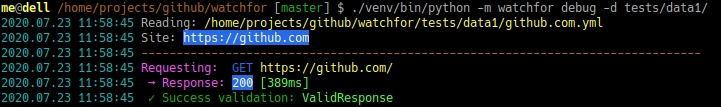

# watchfor

CLI application for monitoring online services

## Features
* checks responses of the HTTP/HTTPS services
* YAML configuration
* notifications via emails in case of failure
* debuging tool for configuration tests
* HTTP headers validation
* HTTP status validation
* parsing HTML/XML
* images validation
* robots.txt validation
* notifies once when service goes down
* TODO: notifies when service goes up

## Installation & usage

#### 1. Install `watchfor` in your local [python virtual enviroment](https://docs.python.org/3/library/venv.html):

```bash
python3 -m venv ./watchforapp
./watchforapp/bin/pip install -e 'git+https://github.com/tru-software/watchfor#egg=watchfor'
```

#### 2. Create a simple configuration

> :+1: Configuration directories are designed to be under repository version control, like a `git`.

```bash
mkdir ~/my_services
git init ~/my_services  # optional, or just put this directory under repo and commit&push configs
```

Create a config file for **service** `~/my_services/github.com.yml` and fill with a following content ([YAML format](https://en.wikipedia.org/wiki/YAML)):
```yml
schema: 1
host: github.com
method: GET
protocol: https
timeout: 10.0
headers:
  accept-encoding: gzip, deflate, br
  accept-language: pl,en-US;q=0.9,en;q=0.8
  accept: text/html,application/xhtml+xml,application/xml;q=0.9,image/webp,image/apng,*/*;q=0.8
  user-agent: Mozilla/5.0 (X11; Linux x86_64) AppleWebKit/537.36 (KHTML, like Gecko) Chrome/83.0.4103.116 Safari/537.36
checks:
  - request: /
    response:
      - ValidResponse
```

The above configuration tests a `http://github.com` site, checks only a main page `/` and expects a valid http response. See `tests/data1` for more complex examples and a documentation (will be available soon) for all options.

#### 3. Test your configuration

```bash
./watchforapp/bin/watchfor debug -d ~/my_services/
```

The response should look as follow:



#### 4. Setup MTA - a mailing gateway

MTA configuration is defined in `_mta.yml` file in your configuration directory. The content of this file looks as follow ([YAML format](https://en.wikipedia.org/wiki/YAML)):
```yml
host: "smtp.gmail.com"
port: 587
user: "your-gmail-user@gmail.com"
password: "xxx-xxx"
ssl: false
tls: true
from: "your-gmail-user@gmail.com"
receivers:
 - "your@email.net"
 - "another.admin@email.net"
```

> :zap: TODO: configuration for a local `sendmail`.

#### 5. Run PRODUCTION checks

> :zap: TODO: configuration for `crontab`

---

This one reads all configurations from a directory `~/my_services/` (`*.yml` files), runs all checks and store results in a file `/tmp/watchfor-my_services.pickle` ([python pickle format](https://docs.python.org/3/library/pickle.html)). In case of failure an email is send according to setup in `_mta.yml`.

```
./watchforapp/bin/watchfor check -d ~/my_services/ -s /tmp/watchfor-my_services.pickle
```

> :+1: Results file (`-s <file>` parameter) keeps latest statuses to prevent spam in the notifications - too much emails in case of longer service downtime/failure. For long service failure only one email is issued for each day.

---

This one reads all configurations from a directory `~/my_services/` (`*.yml` files), runs all checks and store results in a file `/tmp/watchfor-my_services.pickle` (python pickle format).
In case of failure an email is send according to setup from `_mta.yml`.
Additionally all results are stored in the `/tmp/watchfor-my_services.html`.

```
./watchforapp/bin/watchfor check -d ~/my_services/ -s /tmp/watchfor-my_services.pickle -o /tmp/watchfor-my_services.html
```

## Configuration schema

Each YAML file in your data directory contains a configuration for a signle web service to check.

File names:
- must ends with `.yml`
- started with `_` are omited (it is reserved for special cases like `_mta.yml`).


```yml
# Schema versions are for compatibility checking, current supported schema version is 1.
schema: 1

# The base hostname (domain) of the service.
host: github.com

# Default HTTP method of calls. It can be overwriten by each call.
method: GET

# Default HTTP protocol. Available options are: http, https.
protocol: https

# Default timeout period. So far it cannot be overwriten.
timeout: 10.0

# Default headers send by HTTP requests. It can be overwriten by each request.
headers:
  accept-encoding: gzip, deflate, br
  accept-language: pl,en-US;q=0.9,en;q=0.8
  accept: text/html,application/xhtml+xml,application/xml;q=0.9,image/webp,image/apng,*/*;q=0.8
  user-agent: Mozilla/5.0 (X11; Linux x86_64) AppleWebKit/537.36 (KHTML, like Gecko) Chrome/83.0.4103.116 Safari/537.36

# List "checks" contains objects of a definition of the request and expected response.
# Each nested "checks" works the same way.
checks:
  # The "request" key it is a string with path fragment of URL to be called.
  - request: /

  # The "response" key is a list of validations to be performed on HTTP response.
  # For details see: *List of available response validations* below.
    response:
      - ValidResponse
```

#### List of available response validations:

Each response validation is:
- a `string` with the name of the validator or
- an `object` with key `validator` (name of the validator) and custom parameters.

`ValidResponse` - checks a status of the response. Default statuses are `[200, 201]`.
To expect other status use:
```yml
checks:
  - request: /missing-page-or-forbidden
    response:
     - validator: ValidResponse
       status:
         - 400
         - 403
```

`HasHeaders` - checks headers of the response, Validator requires a custom parameter `headers` with an object of expected headers:
```yml
checks:
  - request: /missing-page-or-forbidden
    response:
      - validator: HasHeaders
        headers:
          content-type: text/html; charset=utf-8
          content-encoding: gzip
```

> :+1: The headers keys (names) are case insensitive.

> :+1: In case of `content-type`, all values are parsed with [python-mimeparse](https://github.com/dbtsai/python-mimeparse) (normalisation).

`ValidImage` - expect a response to be an valid image.

Custom parameters checks a minimal size (in pixels) of the image (useful for open-graph images):
```yml
checks:
  - request: /logo.png
    response:
      - validator: ValidImage
        min_size: 100x100
```

In case of extra support for the `webp` format based on `accept` header (see [WebP via Accept Content Negotiation](https://www.igvita.com/2013/05/01/deploying-webp-via-accept-content-negotiation/)), it can be checked as follow:
```yml
checks:
  - request:
      src: /image.webp.jpeg
      headers:
        accept: text/html,image/webp,image/apng
    response:
      - validator: HasHeaders
        headers:
          content-type: image/webp
      - validator: ValidImage
        format: WEBP

  - request:
      src: /image.webp.jpeg
      headers:
        accept: text/html,image/apng
    response:
      - validator: HasHeaders
        headers:
          content-type: image/jpeg
      - validator: ValidImage
        format: JPEG
```

Images are processed by a [Pillow](https://pypi.org/project/Pillow/) library. See [here](https://pillow.readthedocs.io/en/stable/handbook/image-file-formats.html) for complete list of **formats**.

`ValidFavicon` - checks only `content-type` response headers.

`ValidContent` - TODO
Options are `min_length`, `max_length`.

`ValidText` - checks only `content-type` response headers.

`ValidRobotsTxt` - TODO (unimplemented)

`ValidXML` - checks only `content-type` response headers. Useful for sitemaps.

`UnGzip` - expects the response to be a content compressed with `gzip` and decompresses it for following validations. Useful for `/sitemap.xml.gz`.

`ParseHTML` - reads a content of the response and parse it as a HTML document.

Following example reads `<meta property="og:image" content="SOME-URL-TO-IMAGE" />` from the response and checks used image:
```yml
checks:
  - request: /
    response:
      - ValidResponse
      - reader: ParseHTML
        query:
          selector: html head meta[property="og:image"]
          action: ReadProperty
          property: content
          checks:
            - request:
              response:
              - ValidResponse
              - validator: ValidImage
                min_size: 100x100
```

`ParseXML` - reads a content of the response and parse it as a XML document. Useful for sitemaps.

Following example reads the content of the `/sitemap.xml` (witch contains a `sitemapindex`) and grabs first `sitemap` to get real page (depends on site configuration):
```yml
checks:
  - request: /sitemap.xml
    response:
      - ValidResponse
      - ValidXML
      - reader: ParseXML
        query:
          # the content is <sitemapindex><sitemap><loc>/sitemap-page-01.xml.gz</loc></sitemap></sitemapindex>
          selector: sitemapindex sitemap:first-of-type loc
          action: ReadContent
          checks:
            # request would call: /sitemap-page-01.xml.gz
            - request:
              response:
                - ValidResponse
                - UnGzip
                - reader: ParseXML
                  query:
                    # the content is <urlset><url><loc>/content-page-0001.html</loc></url></urlset>
                    selector: urlset url:first-of-type loc
                    action: ReadContent
                    checks:
                      # request would call: /content-page-0001.html
                      - request:
                        response:
                          - ValidResponse
                          - validator: HasHeaders
                            headers:
                              content-type: text/html; charset=utf-8
                          - reader: ParseHTML
                            query:
                              # just read the page and check og:image
                              selector: html head meta[property="og:image"]
                              action: ReadProperty
                              property: content
                              checks:
                                - request:
                                  response:
                                    - ValidResponse
                                    - validator: ValidImage
                                      min_size: 100x100
```

> :bomb: Please note for selector: `selector: urlset url:first-of-type loc` - this takes only first occurance of the `<url></url>` in the `<urlset></urlset>`. Without the `:first-of-type` all `<url></url>` would be processed - it may take some time to visit all pages in the sitemap index.

> :+1: For available options for selectors see [paring library](https://www.crummy.com/software/BeautifulSoup/bs4/doc/#css-selectors) and [general specifycation ](https://facelessuser.github.io/soupsieve/selectors/pseudo-classes/).

## Installation for a development

Clone `watchfor` repo from github and create local [python virtual enviroment](https://docs.python.org/3/library/venv.html):

```bash
git clone 'https://github.com/tru-software/watchfor'
cd watchfor
python3 -m venv ./venv
./venv/bin/pip install -r requirements.txt
./venv/bin/pip install -r requirements-dev.txt
```

##### Run `debug` for sample configuration:
```bash
./venv/bin/python -m watchfor debug -d ./tests/data1/
```

##### Run unit-tests (`pytest`) only once:
```bash
./venv/bin/pytest watchfor/tests
```

##### Run unit-tests (`pytest` + `pytest-watch`) after each code change (auto reload):
```bash
./venv/bin/ptw watchfor -- watchfor/tests
```

##### Run `debug` after each code change (auto reload with `watchdog`)
```bash
./venv/bin/watchmedo auto-restart --ignore-directories --recursive -d . -p '*.py;*.
mako;*.yml' -- ./venv/bin/python -m watchfor debug -d ./tests/data1/
```
